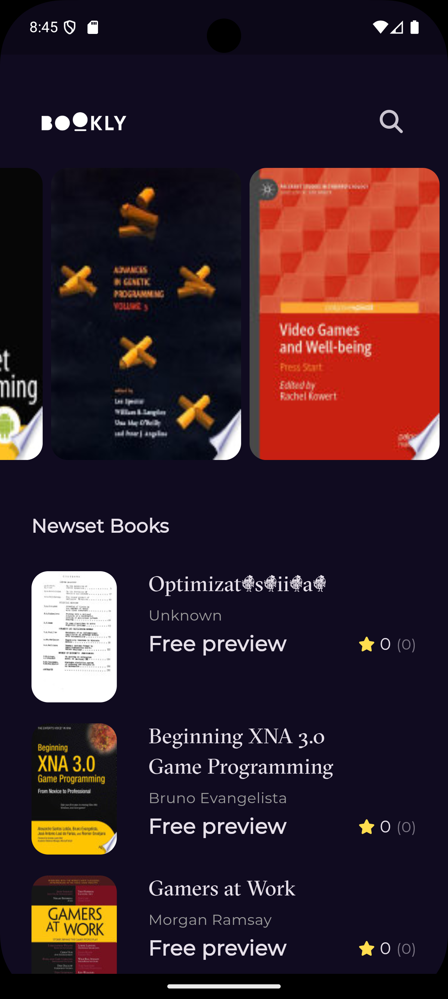
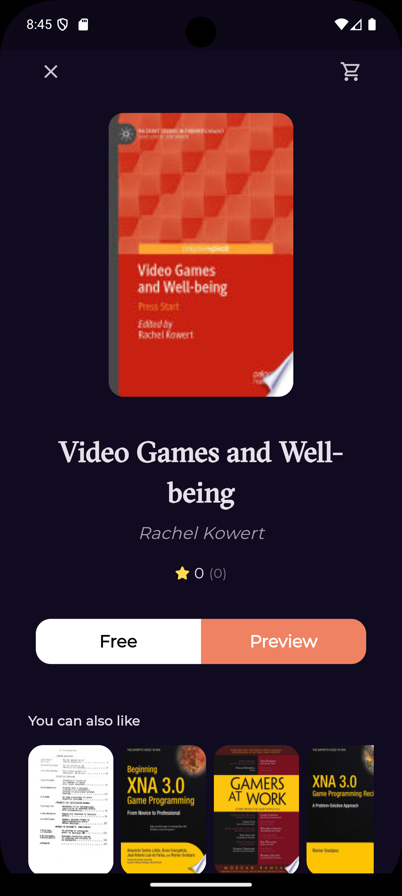

# Ebook App

A Flutter app for previewing free books using the **Google Books API**. Built with **MVVM architecture** and popular Flutter packages for a clean and maintainable codebase.

---

## Features

- **Search for Books**: Search for free books by title, author, or keyword.
- **Preview Books**: View book details like title, author, description, and cover image.
- **Launch Previews**: Open book previews directly in your browser.
- **MVVM Architecture**: Follows the **Model-View-ViewModel** pattern for clean separation of concerns.
- **State Management**: Uses **Cubit** for predictable and scalable state management.
- **Dependency Injection**: **GetIt** for modular and testable code.
- **Routing**: **GoRouter** for declarative navigation and deep linking.
- **Error Handling**: **Dartz** for robust error handling.
- **Equatable**: Simplifies equality checks for immutable objects.

---

## Screenshots

| **Home Screen** | **Book Details** | **Preview in Browser** |
|------------------|------------------|------------------------|
|  |   |

---

## Packages Used

- **Dio**: For making HTTP requests to the Google Books API.
- **Url_Launcher**: To open book preview links in the browser.
- **Go_Router**: For declarative routing and navigation.
- **GetIt**: For dependency injection.
- **Cubit**: For state management.
- **Dartz**: For functional error handling.
- **Equatable**: For simplifying equality checks.

---

## How to Use

1. **Search for Books**:
   - Enter a search term (e.g., book title, author, or keyword) in the search bar.
   - The app fetches and displays a list of free books from the Google Books API.

2. **Preview Books**:
   - Tap on a book to view its details.
   - Use the "Preview" button to open the book preview in your browser.

---

## How to Get the App

### Prerequisites
- Flutter SDK installed on your machine.
- An IDE (e.g., Android Studio, VS Code) with Flutter and Dart plugins.

### Steps to Run the App
1. **Clone the Repository**:
   ```bash
   git clone https://github.com/your-username/ebook_app.git
   cd ebook_app
